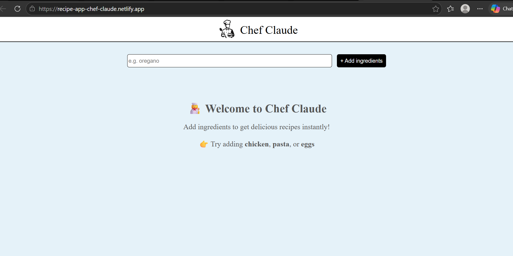
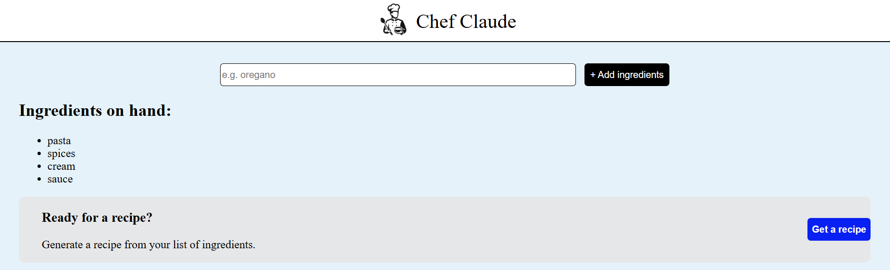
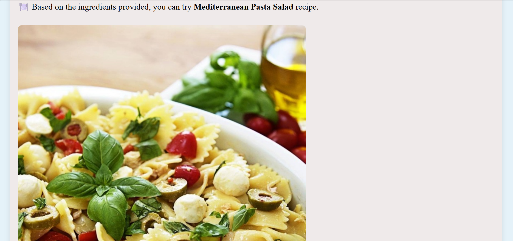
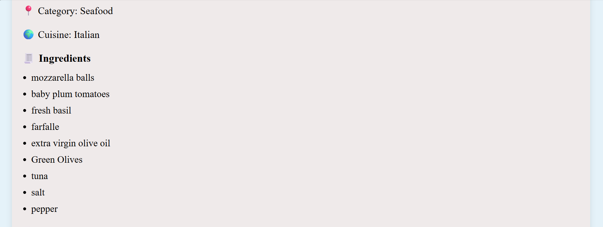
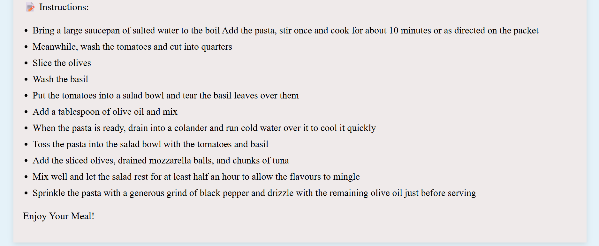

# Chef Claude – AI Recipe Application

## Overview

Chef Claude is a React-based recipe generation application that recommends recipes based on ingredients provided by the user. Users can enter ingredients (atleast 4 ingredients), generate recipes through API integration, and view recipe details including the dish name, ingredients list, and preparation instructions.

## Features

* Ingredient-based recipe generation
* API integration for recipe recommendations
* Dynamic recipe suggestions
* Dish name display
* Ingredient list generation
* Step-by-step recipe instructions
* Responsive user interface
* Conditional rendering based on user input

## Technologies Used

* React.js
* JavaScript (ES6+)
* HTML5
* CSS3
* REST API Integration

## Live Demo

https://recipe-app-chef-claude.netlify.app/

## Installation

1. Clone the repository
2. Run `npm install`
3. Run `npm run dev`

## Learning Outcomes

* API integration
* Asynchronous JavaScript
* Data fetching with APIs
* React Hooks
* Conditional rendering
* State management

## Screenshots

* Home Page

* Ingredients Added

* Generated Recipe

* Ingredients List

* Instructions 

